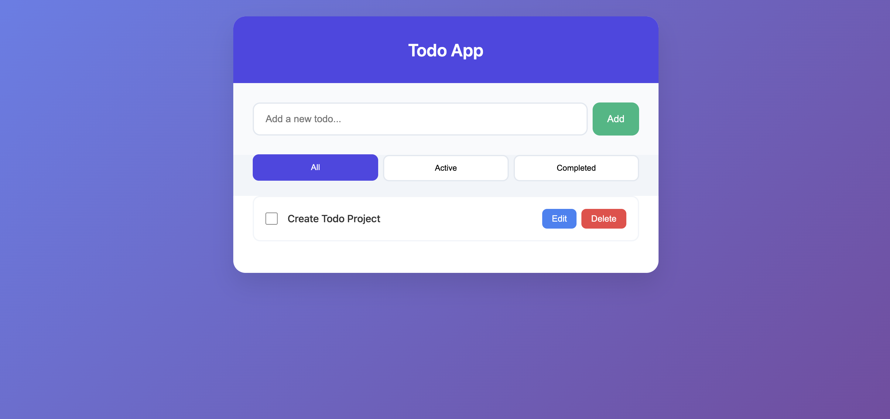
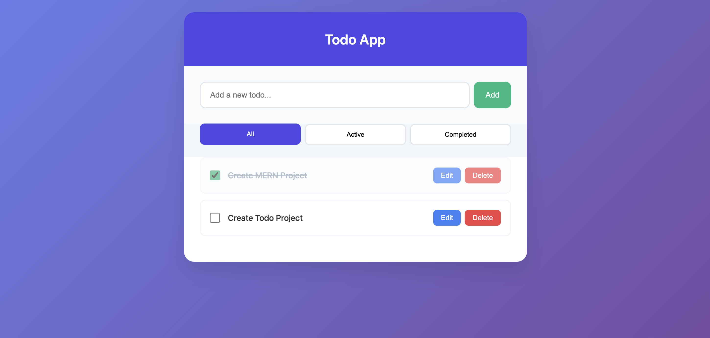
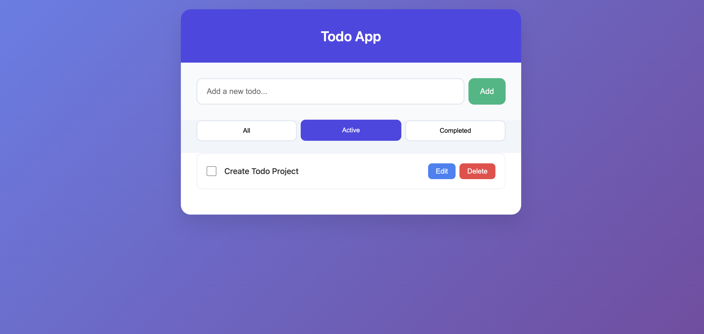
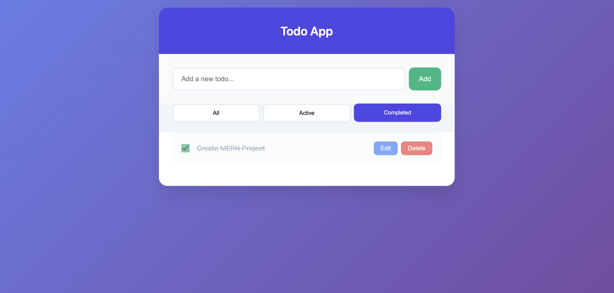
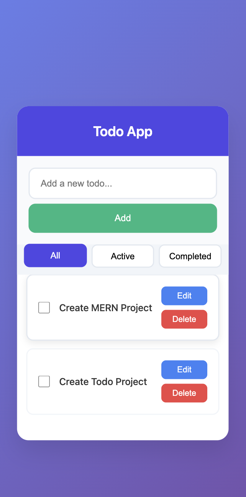
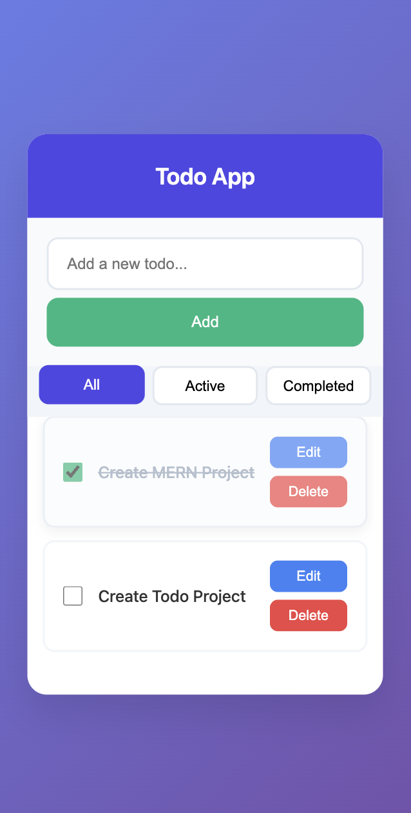
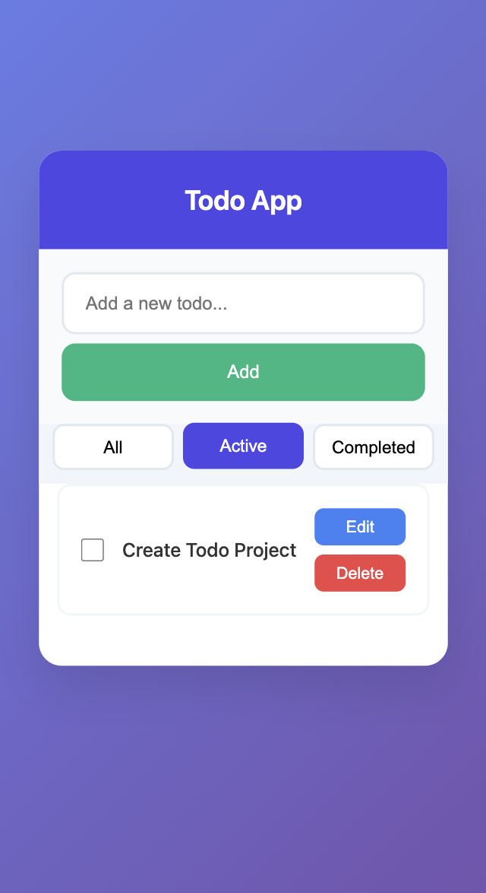
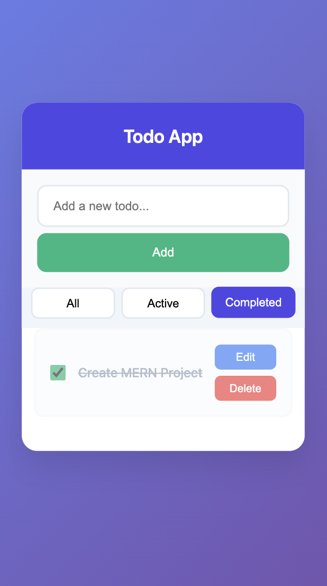

# React Todo App

A clean and production-ready Todo application built with React.

 

## Todo App Features
- Add/Edit/Delete todos with inline editing
- Mark Complete with visual strikethrough
- LocalStorage Persistence - data survives refresh
- Filter Tabs - All/Active/Completed
- Fully Responsive - Mobile-first design
- Clean Modern UI - Glassmorphism + smooth hovers
- Custom Hook - useLocalStorage for state management

## Responsive Screenshots

|                          | Home                  | Activity Checked      | Filter Active         | Filter Completed      |
|--------------------------|-----------------------|-----------------------|-----------------------|-----------------------|
| **Desktop (1200px+)**    |  |  |  |  |
| **Mobile (375px)**       |  |  |  |  |

## Tech Stack
- React
- Vite
- JavaScript
- CSS

## Setup
# Clone the repo
git clone https://github.com/yourusername/react-todo-app.git
cd react-todo-app

# Install dependencies
npm install

# Run development server
npm run dev

## Folder Structure
src/
├── components/
│   ├── TodoInput.jsx       # Add/Edit form
│   ├── TodoItem.jsx        # Individual todo
│   ├── TodoList.jsx        # Filtered list
│   └── FilterTabs.jsx      # Filter buttons
├── hooks/
│   └── useLocalStorage.js  # Custom persistence hook
├── pages/
│   └── Home.jsx           # Main app container
├── styles/
│   └── app.css            # Responsive styles
├── App.jsx
└── main.jsx

## Data Model
{
  id: string,        // crypto.randomUUID()
  title: string,     // Todo text
  completed: boolean,// Completion state
  createdAt: Date    // Timestamp
}

## Key Implementation Highlights
- Custom Hook: useLocalStorage persists state automatically
- Controlled Forms: Clean input handling with React state
- Filter Logic: Pure functional filtering without re-renders
- Responsive Design: Mobile-first CSS with proper breakpoints
- Accessibility: Semantic HTML + keyboard navigation ready
- Performance: Optimized re-renders with proper key props

## Development Scripts
npm run dev     # Start dev server
npm run build   # Production build
npm run lint    # ESLint check
npm run preview # Preview production build

Built with ❤️ using React
© Jitendra Jadhav 🚀

